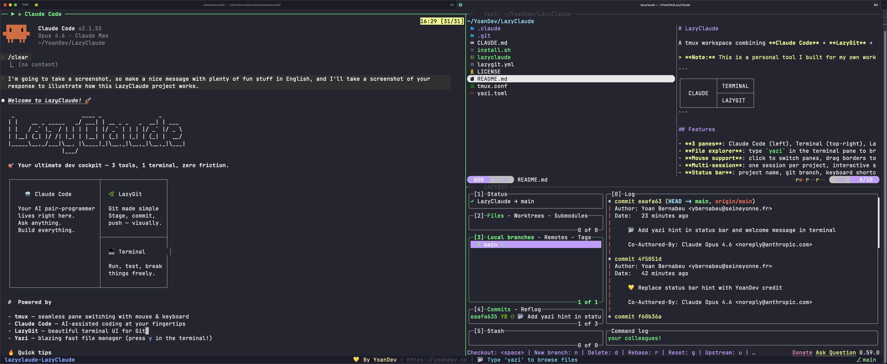

# LazyClaude

A tmux workspace combining **Claude Code** + **LazyGit** + **Terminal** in a single command.

> **Note:** This is a personal tool I built for my own workflow. I'm sharing it publicly in case it's useful to others. Designed for **macOS** (uses Homebrew for dependencies). It may work on Linux with minor adjustments, but that's untested.

```
┌──────────┬──────────┐
│          │ TERMINAL │
│  CLAUDE  ├──────────┤
│          │ LAZYGIT  │
└──────────┴──────────┘
```



## Features

- **3 panes**: Claude Code (left), Terminal (top-right), LazyGit (bottom-right)
- **File explorer**: type `yazi` in the terminal pane to browse files
- **Mouse support**: click to switch panes, drag borders to resize
- **Multi-session**: one session per project, interactive session manager
- **Status bar**: project name, git branch, keyboard shortcuts
- **Visual indicator**: green `▶` on active pane, heavy borders

## Prerequisites

- [tmux](https://github.com/tmux/tmux) (`brew install tmux`)
- [Claude Code](https://claude.ai/download) (`npm install -g @anthropic-ai/claude-code`)
- [LazyGit](https://github.com/jesseduffield/lazygit) (`brew install lazygit`)
- [Yazi](https://github.com/sxyazi/yazi) (`brew install yazi`)
- [micro](https://micro-editor.github.io/) (`brew install micro`) — editor used by Yazi to open files

## Install / Update

> **Warning:** The install script will overwrite `~/.tmux.conf`, `~/.config/lazygit/config.yml`, `~/.config/yazi/yazi.toml` and `~/.local/bin/lazyclaude` without confirmation. Back up your configs first if you have custom ones. For more control, see [Manual installation](#manual-installation).

```bash
curl -fsSL https://raw.githubusercontent.com/yoanbernabeu/lazyclaude/main/install.sh | bash
```

Run it again anytime to update to the latest version.

## Usage

```bash
cd my-project
lazyclaude
```

### Session management

When existing sessions are detected, an interactive menu appears:

```
🟢 Active lazyclaude sessions:

  1) lazyclaude-project-a
  2) lazyclaude-project-b

What do you want to do?
  a) Attach to an existing session
  n) New session
  k) Kill a session
  K) Kill ALL sessions
  q) Quit
```

### Navigation

| Action | Shortcut |
|--------|----------|
| Switch pane | Mouse click or `Ctrl+b` + arrow key |
| Zoom pane (fullscreen) | `Ctrl+b` then `z` |
| File explorer | Type `yazi` in the terminal pane |
| Resize pane | Drag the border |
| Detach session | `Ctrl+b` then `d` |

## Manual installation

1. Copy `lazyclaude` to a directory in your `$PATH` (e.g. `~/.local/bin/`)
2. Make it executable: `chmod +x ~/.local/bin/lazyclaude`
3. Copy `tmux.conf` to `~/.tmux.conf` (or append its content to yours)
4. Copy `lazygit.yml` to `~/.config/lazygit/config.yml`
5. Copy `yazi.toml` to `~/.config/yazi/yazi.toml`


## License

MIT
